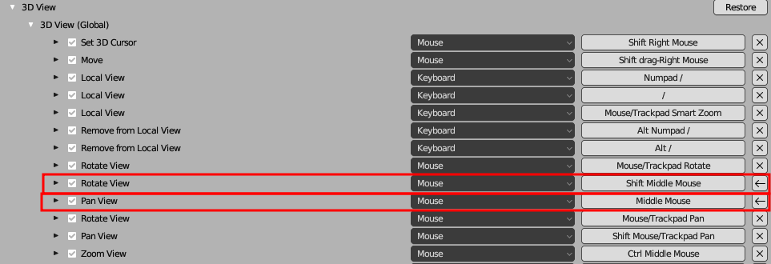
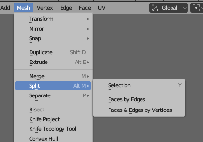

Blender
=======

#### MANUAL
https://docs.blender.org/manual/en/3.6/index.html

Switch ROTATE and PAN in BLENDER.

`Edit -> Preferences -> Keymap`  

### 3D CURSOR

#### Cursor to World Origin:  
`Shift+c` .  
Reset Cursor location to 0,0,0 in View panel  

Position Cursor on object surface: `Shift+RMB`

### EDITING

#### Extrude along normals
* Edit Mode
* Tool: Toolbar ‣ Extrude Region ‣ Extrude Along Normals
* Menu: Mesh ‣ Extrude ‣ Extrude Faces Along Normals
* Shortcut: `Alt-E`

#### Origin
`Shift+s` to choose where to set origin  

#### Viewport Focus
`Numpad point` to focus on active object

#### Local Axis Editing
To Move/Scale/Rotate on an object’s local axis (if the object has been rotated on the world axis) press the axis defining letter twice:
For example: `G Y Y` to move along an object’s local Y axis

#### Separate all faces
Mesh -> Split -> Faces by Edges  
`Alt-m`  

#### Camera
* Numpad 0 to set the current viewport view to camera view.
* Alt+Numpad 0 to set the camera view to the current viewport view.
* To move the camera while looking through it (without setting the lock camera to view setting) select the camera frame in the viewport and use XX YY ZZ to operate on the cameras local axes
* Rotate object along camera axis: Select the Object, then shift Select Camera. N to open thingy pane. Right click the property you want to apply to the object and select Copy Single to Selected.  

#### Add all selected objects to new collection
Select objects in Outliner and with mouse over Outliner: `m` - New Collection  

Select objects in view window:  
Object -> Move to Collection - New Collection  
  

#### Parent
`Ctrl p`

#### Unparent
`alt p` (Clear Parent) > Clear and Keep Transformation.

#### Select More/Less
Menu: Select ‣ Select More/Less ‣ More
Shortcut: `Ctrl-NumpadPlus`

Menu: Select ‣ Select More/Less ‣ Less
Shortcut: `Ctrl-NumpadMinus`

#### Transform object origin to face normal

1. In EDIT mode Select a face of the object, whose normal you want to be Object Z, and in the `Header > Transform Orientations` dropdown, hit the '+' to create a Custom Orientation from it.
2. In the Object Mode `Header > Options` menu, check 'Origins'
3. With the object (and therefore its axis) selected, `Header > Object > Transform > Align to Transform Orientation`, selecting the orientation you have just created, from the dropdown in the 'Adjust Last Operation' Panel.
4. Switch the 'Origins' option off again

You can create a Custom Orientation from any 3 vertices. Or determine Y down an edge, or from any 2 vertices. In both of those cases, though, you might be 180 degrees out; the selection is not ordered.

#### Knife Tool

`Shift-k` to CUT THROUGH and only operate on selected faces

### SHADING/TEXTURE NODES/UV

Group nodes together: `Ctrl-g`
To re-enter node group or exit node group select and press `TAB`

Join two nodes with MIX NODE
`Ctrl+Shift drag right mouse click` from one node to the other

To flip or adjust the mesh in general while keeping the image texture static.
While in 'Edit' mode, click on 'Options' just below the 'Viewport Shading' modes on the top right corner, then click on `Correct Face Attributes`. Now when you scale the mesh on the X-axis by -1, it will flip the mesh while keeping the image texture in place.

### OUTLINER/PROPERTIES

#### Modify object or modifier properties for multiple objects at once
Select all objects to be affected.
Hold `Alt` while changing property

#### Open/Close hierarchy
Click arrow of parent with `SHIFT`

