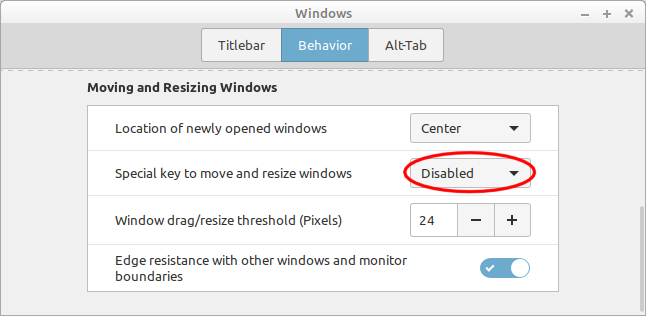

Misc
====

Vivaldi saved sessions: `/home/goatfarm/.config/vivaldi`  
GIMP Settings `/home/goatfarm/.config/GIMP`

#### Disable ALT move windows  

#### Create Symbolic Link
`ln -s source_file symbolic_link`

#### Custom Launcher in Mint Cinnamon

https://tutorialforlinux.com/2019/05/11/linux-mint-cinnamon-how-to-create-app-launcher-on-main-menu/

#### OCR Text
`tesseract scannedText.png outputFile.txt`
