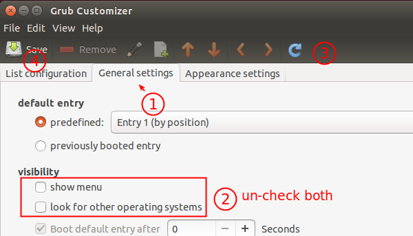

SYSTEM
======

#### Show Desktop with Super+d
In the “Keyboard Shortcuts”, scroll down to the “Window Management” header and search for the “Hide all normal windows and set focus to the desktop”.

The “Show Desktop” shortcut can be changed there.

#### Flameshot Ctrl+PrtScr
Create new keyboard shortcut with this command and set to Ctrl+Print
`/usr/bin/flameshot gui`

#### Open Home Folder with Super+e
Create new keyboard shortcut in Settings/Keyboard Shortcuts

Set Command to be:  
`/usr/bin/caja --no-desktop --browser /home/goatfarm`  
(Or whatever your home folder is called)

Assign it to Super-e by pressing those two keys (it will say Mod+E or something like that)

`/usr/bin/caja --no-desktop --browser /home/hamphithea`

#### Make Symlink in UBUNTU
`ln -s <TARGET> <DESTINATION>`

`ln -s /home/hamphithea/Documents/UNREAL/Linux_Unreal_Engine_5.1.1/Engine/Binaries/Linux/UnrealEditor /home/hamphithea/Desktop`

`ln -s /home/hamphithea/Music/VCV/Rack2Free/Rack /home/hamphithea/Desktop`

#### Remove Second Boot Partition From Linux Mint
If you installed the other OS after installing Mint then the other OS has control of grub/booting.

So in Mint run `sudo grub-install /dev/sda` to give control of booting back to Mint.

Then reboot to make sure everything is OK. Mint should be the first in your dual boot grub menu.

If all looks good you can delete the other OS via gparted or just reformat the partition.

After doing either of the aforementioned run `sudo update-grub` so the other OS gets cleared from grub.cfg.

#### Hide Grub boot menu
* Use graphical tool grub-customizer
* sudo add-apt-repository ppa:danielrichter2007/grub-customizer 
* sudo apt-get update
* sudo apt-get install grub-customizer

1. Switch to General settings.
2. un-check the boxes which say “show menu” and “look for other operating systems.”
3. Click refresh button.
4. Click Save button.

